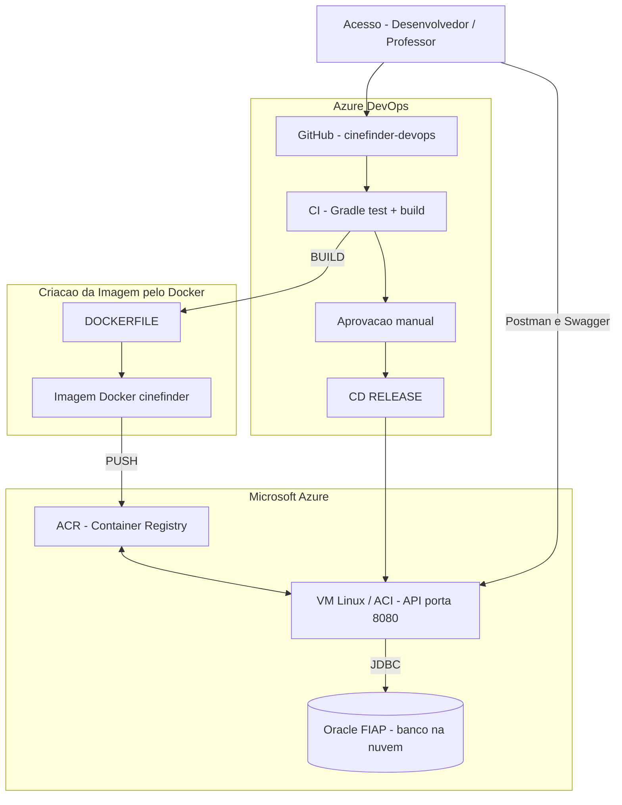

# CineFinder API — Entrega DevOps

API REST para gerenciamento de filmes, avaliações (reviews) e listas personalizadas. Esta versão integra a solução a um fluxo de CI/CD no Azure DevOps com deploy em VM no Microsoft Azure e persistência em banco relacional na nuvem.

---

## Descrição da solução

O CineFinder permite que usuários se registrem, autentiquem com JWT e executem operações de CRUD em reviews e listas de filmes. O catálogo de filmes é consultado via API; reviews ligam usuários a filmes e listas agrupam filmes por usuário. O banco Oracle (nuvem FIAP) armazena as tabelas relacionais com integridade referencial (Flyway). A API é empacotada com Docker para execução na VM Azure após build e testes automatizados na pipeline.

---

## Benefícios de negócio

- **CI/CD:** reduz deploy manual, padroniza releases e diminui falhas em produção.
- **Testes automatizados:** aumentam a confiança antes de publicar na VM.
- **Nuvem (VM + banco):** ambiente acessível para demonstração, escala e evidência de persistência real dos dados no trabalho acadêmico.

---

## Arquitetura macro do projeto

Fluxo: GitHub → Azure DevOps (CI/CD) → Docker → ACR → VM/ACI → Oracle FIAP.




Texto dissertativo (PDF): [docs/arquitetura-macro.md](docs/arquitetura-macro.md)

---

## Ferramentas e versões

| Ferramenta | Versão |
|------------|--------|
| Java (Temurin) | 17 |
| Gradle Wrapper | do repositório (`gradlew`) |
| Spring Boot | 4.0.3 |
| Spring Data JPA / Security / Web | via Spring Boot BOM |
| Flyway | via `spring-boot-starter-flyway` |
| Oracle JDBC (ojdbc11) | runtime |
| H2 | apenas profile `dev` (local) |
| Springdoc OpenAPI | 3.0.2 |
| JJWT | 0.11.5 |
| Docker | recomendado 24+ na VM |
| Azure DevOps | Pipelines + Environments |
| Postman | para testes CRUD (collection em `postman/`, quando adicionada) |

---

## Pré-requisitos

- JDK 17 instalado (`java -version`)
- Git
- (Opcional) Docker Desktop para simular o deploy

---

## Como clonar e executar localmente

```powershell
git clone https://github.com/matheusmariotto1206/cinefinder-devops.git
cd cinefinder-devops
```

### Testes

```powershell
.\gradlew.bat test
```

Resultado esperado: `BUILD SUCCESSFUL`.

### API com Oracle (padrão — banco na nuvem FIAP)

Configure seu RM/senha Oracle via variáveis de ambiente (não commite senhas):

```powershell
$env:SPRING_DATASOURCE_URL="jdbc:oracle:thin:@oracle.fiap.com.br:1521:ORCL"
$env:SPRING_DATASOURCE_USERNAME="SEU_RM"
$env:SPRING_DATASOURCE_PASSWORD="SUA_SENHA"
.\gradlew.bat bootRun
```

Swagger: http://localhost:8080/swagger-ui/index.html

### API com H2 (somente desenvolvimento local)

**Não usar em produção** (penalidade por H2 em ambiente final).

```powershell
$env:SPRING_PROFILES_ACTIVE="dev"
.\gradlew.bat bootRun
```

---

## Deploy na VM Azure (produção)

A API em produção deve rodar na **VM Linux Azure** (porta 8080), não apenas no notebook do desenvolvedor.

Exemplo com Docker na VM:

```bash
git clone https://github.com/matheusmariotto1206/cinefinder-devops.git
cd cinefinder-devops
docker build -t cinefinder .
docker run -d -p 8080:8080 \
  -e SPRING_DATASOURCE_URL="jdbc:oracle:thin:@oracle.fiap.com.br:1521:ORCL" \
  -e SPRING_DATASOURCE_USERNAME="SEU_RM" \
  -e SPRING_DATASOURCE_PASSWORD="SUA_SENHA" \
  --name cinefinder cinefinder
```

Substitua `SEU_RM` / `SUA_SENHA` pelas credenciais do grupo. A URL da API na VM será `http://IP_PUBLICO_VM:8080`.

---

## Pipeline Azure DevOps

O arquivo `azure-pipelines.yml` (na raiz) define:

1. **CI:** checkout → Java 17 → `./gradlew test build` → artefato JAR  
2. **Approval:** validação manual (code review)  
3. **CD:** deploy na VM via SSH + Docker  

### Como executar a pipeline

1. Acesse o projeto no Azure DevOps.  
2. **Pipelines** → selecione a pipeline do repositório `cinefinder-devops`.  
3. **Run pipeline** na branch `main` (ou após push).  
4. Aprove o stage de validação manual quando solicitado.  
5. Verifique o deploy e teste a API na URL da VM.

Variáveis secretas (Library / Environment): `SPRING_DATASOURCE_*`, credenciais SSH da VM, etc.

> **Nota:** configure a Service Connection SSH (`vm-cinefinder-ssh`) e o Environment `production` com aprovadores no Azure DevOps antes do primeiro CD.

---

## DDL (entrega)

O DDL das tabelas está em:

- Flyway: `src/main/resources/db/migration/oracle/V2__create_tables.sql`  
- Cópia para entrega: `docs/schema.ddl` (quando adicionado ao repositório)

Tabelas principais: `cf_user`, `cf_movie`, `cf_review`, `cf_movie_list`, com chaves estrangeiras entre usuário, review, filme e lista.

---

## Testes de API (Postman)

Importe a collection em `postman/CineFinder.postman_collection.json` (quando disponível no repositório).

Fluxo sugerido:

1. Register → Login (token JWT)  
2. CRUD em `/api/reviews`  
3. CRUD em `/api/lists`  

Variável `baseUrl`: `http://localhost:8080` (local) ou `http://IP_VM:8080` (entrega).

---

## Base URL

| Ambiente | URL |
|----------|-----|
| Local | `http://localhost:8080` |
| VM Azure | `http://IP_PUBLICO_VM:8080` |

---

## Autenticação

### Registro

`POST /auth/register`

```json
{
  "name": "Jon",
  "email": "jon@email.com",
  "password": "123456",
  "age": 20
}
```

### Login

`POST /auth/login`

```json
{
  "email": "jon@email.com",
  "password": "123456"
}
```

Retorna token JWT. Use header `Authorization: Bearer {token}` nos endpoints protegidos.

---

## Endpoints — Filmes

| Método | Rota |
|--------|------|
| GET | `/api/movies?page=0&size=10` |
| GET | `/api/movies/{id}` |
| GET | `/api/movies/{id}/reviews` |

---

## Endpoints — Reviews (CRUD)

| Método | Rota |
|--------|------|
| POST | `/api/reviews` |
| GET | `/api/reviews?page=0&size=10` |
| GET | `/api/reviews/{id}` |
| PUT | `/api/reviews/{id}` |
| DELETE | `/api/reviews/{id}` |

Exemplo create:

```json
{
  "userId": 1,
  "movieId": 1,
  "rating": 8.5,
  "comments": "Muito bom!"
}
```

---

## Endpoints — Listas (CRUD)

| Método | Rota |
|--------|------|
| POST | `/api/lists` |
| GET | `/api/lists?page=0&size=10` |
| GET | `/api/lists/{id}` |
| PATCH | `/api/lists/{id}` |
| DELETE | `/api/lists/{id}` |
| POST | `/api/lists/{id}/movies/{movieId}` |
| DELETE | `/api/lists/{id}/movies/{movieId}` |

---

## Admin

| Método | Rota |
|--------|------|
| GET | `/admin` |

---

## Paginação

```
?page=0&size=10&sort=campo,asc
```

---

## Swagger

- http://localhost:8080/swagger-ui/index.html  
- Na VM: `http://IP_VM:8080/swagger-ui/index.html`

---

## Evidências (professor)

Após executar a pipeline e o CRUD na VM, registre no relatório/PDF:

- Print da pipeline (CI + CD + aprovação)  
- Print do Postman com respostas 2xx  
- Print/consulta SQL mostrando linhas em `cf_review` / `cf_movie_list`  

---

## Equipe

Preencher no PDF de entrega: nomes, RMs, link deste repositório e link do vídeo no YouTube.
