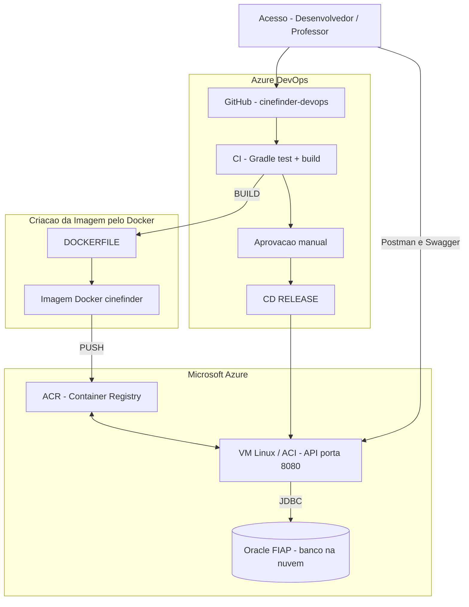

# Arquitetura Macro do Projeto — CineFinder DevOps

Diagrama no padrão da disciplina (Azure DevOps + Docker + Microsoft Azure).

**Repositório de entrega:** `matheusmariotto1206/cinefinder-devops`  
**Código base da API:** `challengezinho/cinefinder-java-advanced` (somente origem; não é o repo entregue)

---

## Diagrama (fonte Mermaid)

Arquivo editável: `docs/diagrama/arquitetura.mmd`  
Exportar PNG: https://mermaid.live → salvar como `docs/diagrama/arquitetura-macro.png` para o PDF.

---

## Legenda dos componentes

| Componente | Função no CineFinder |
|------------|----------------------|
| **Acesso** | Desenvolvedor ou professor: GitHub, Azure DevOps, Postman, Swagger |
| **GitHub (cinefinder-devops)** | API Spring Boot, Dockerfile, `azure-pipelines.yml`, Postman, DDL |
| **CI** | `./gradlew test build` no push |
| **Aprovação manual** | Gate de code review antes do deploy |
| **CD RELEASE** | Deploy do container na nuvem |
| **DOCKERFILE / Imagem** | Empacota a API Java 17 (porta 8080) |
| **PUSH → ACR** | Registry de imagens no Azure |
| **VM / ACI** | API em produção (não só no notebook) |
| **Oracle FIAP** | Persistência CRUD (`cf_user`, `cf_review`, `cf_movie`, `cf_movie_list`) |
| **Postman e Swagger** | Testes e demonstração no vídeo |

---

## Fluxo (dissertação para o PDF)

1. Push no **cinefinder-devops** (GitHub).
2. **Azure DevOps** executa **CI** (testes + build).
3. **BUILD** gera imagem Docker via **Dockerfile**.
4. **PUSH** envia imagem ao **ACR**.
5. **Aprovação manual** libera o **CD RELEASE**.
6. **CD** publica container na **VM/ACI** (porta 8080).
7. API conecta ao **Oracle** via JDBC.
8. **CRUD** no Postman persiste dados no banco (evidência no vídeo).

---

## Ferramentas (nome e versão)

| Ferramenta | Versão |
|------------|--------|
| Java Temurin | 17 |
| Spring Boot | 4.0.3 |
| Gradle Wrapper | do repositório |
| Docker | 24+ |
| Azure DevOps Pipelines | projeto do grupo |
| Azure Container Registry | Azure |
| VM Linux Ubuntu | 22.04 |
| Oracle Database | FIAP Cloud |
| Postman | collection no repo |
