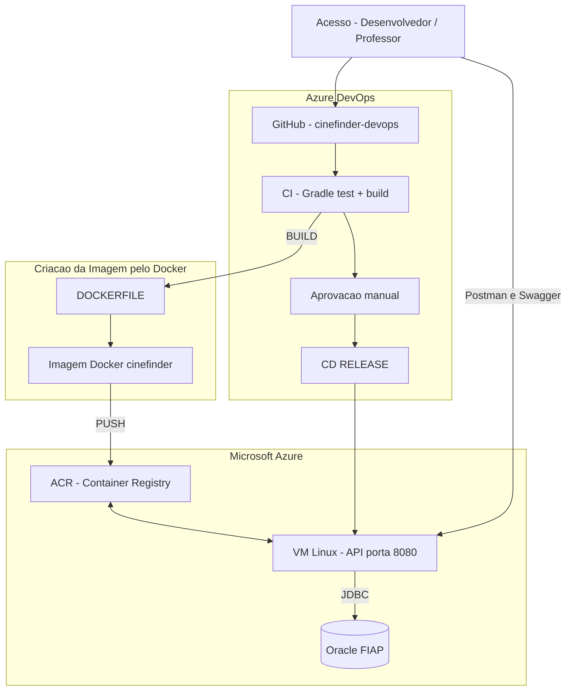

# Arquitetura macro — CineFinder DevOps

## Diagrama

Arquivo fonte: `docs/diagrama/arquitetura.mmd`

## Componentes

| Componente | Função |
|------------|--------|
| GitHub | Código, pipeline YAML, Postman, DDL |
| CI | Testes e build do JAR |
| Aprovação manual | Revisão antes do deploy |
| CD | Deploy Docker na VM |
| VM Azure | API em produção (172.171.193.127:8080) |
| Oracle FIAP | Persistência relacional |
| Postman / Swagger | Testes e documentação da API |

## Fluxo da pipeline

1. Push no repositório dispara a pipeline.
2. CI executa testes (H2) e gera o JAR.
3. Aprovação manual libera o CD.
4. CD envia o JAR à VM, monta a imagem e sobe o container.
5. A API conecta ao Oracle; CRUD persiste dados no banco.
